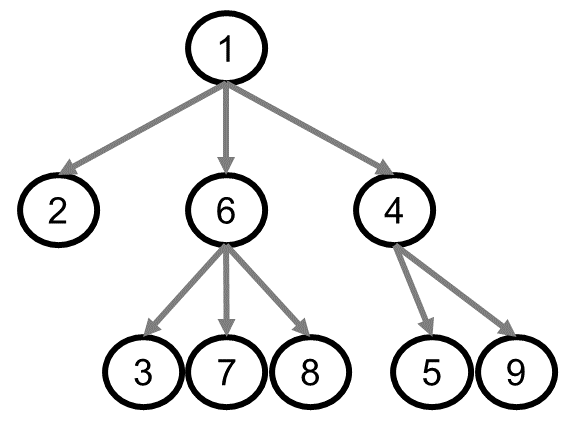

# Question Order Documentation

The question order is important in three parts of the application:

1. The initial display of the HPI to the user
2. The code for generating a coherent paragraph of text based on the user's
answers to the HPI questions.
3. The Create Template feature that enables users to make their own knowledge
graphs which in turn can be used in the HPI section.

The usage of question order is slightly different in all three scenarios.

## Graph for question order examples

The following knowledge graph will be used to explain the different use cases
of question order:

In this graphic, the number in each node is the question order. The root node
has question order 1. The root node will always have question order 1.

## Use Case 1: Question order in display of the HPI to the user

The HPI should be display first according to the knowledge graph structure,
and second according to relative ascending question order.

Thus, the root node is displayed first, if the root node has question text.
Sometimes the root node does not have question text. Root nodes are the only
kind of node that may not have question text. This is because in some cases,
the root question has already been answered by virtue of the user selecting
that particular knowledge graph. For example if a user has selected the
Chest Pain knowledge graph it would be redundant to ask them 'Do you have
chest pain?' and therefore the root node of the Chest Pain graph has no
question text.

The next questions to be displayed are always the children of the root. In our
example that means questions 2, 6, and 4 should be displayed next. They should
be displayed in ascending question order, so that means they should be displayed
as 2, then 4, then 6.

The 'children of the children' will only be displayed if the user provides a
particular answer. The 'answer leading to more questions' is specified in
the knowledge graph and is an attribute of a node. At the moment, only
yes or no questions can lead to follow-up questions, which means that the
'answer leading to more questions' is either 'YES' or 'NO'.
For example, the children of node 6 may only be displayed
if the user answers 'YES' to question 6. If the children of node 6 are displayed,
then they should be displayed immediately beneath node 6, and indented.
They should be displayed in their relative ascending question order, which
is 3, then 7, then 8.

Similarly, if the user answers 'YES' to question 4, then the children of node
4 should be displayed in ascending integer order, which is 5 then 9.

## Use Case 2: Question order in generating a paragraph of text based on the HPI

The next use case of question order involves the code that generates a
paragraph of text based on the user's answers to the questions in the HPI section.
Each node results in a single sentence being generated. The question order
determines the order in which the sentences will be concatenated to produce
the final paragraph. The paragraph exactly follows the question order, ignoring
the graph hierarchy (although a lot of times the question order does somewhat
follow the graph hierarchy, since the goal of the question order is to
ensure that questions are presented in an order that makes sense and also that
sentences are strung together in an order that makes sense.) Thus, when the
paragraph is generated, it will put the sentences from each node in the order
1, 2, 3, 4, 5, 6, 7, 8, and 9.

TODO: Rachel is currently working on how to decide the sentence order in
the generated HPI paragraph when a single knowledge graph references questions
from other knowledge graphs. Rachel is also working on how to decide the sentence
order when the user has selected multiple potentially interrelated diseases that
may share questions.

## Use Case 3: Question order in Create Template

The Create Template feature enables users to create their own knowledge graph
for any disease or condition of their choosing. When creating a knowledge graph,
a user can initialize it from scratch, or they can initialize it from an
existing knowledge graph. If the user initializes the graph from an existing
knowledge graph, we do not want to end up 'duplicating' all of the nodes of
that graph in the graph database. Therefore, we will only save a node as a new
node if the user changes any of its attributes - for example, if they change
the question text, the question type, or the answer options.

Question order is significant because we also do not want to duplicate nodes
in the database if the only attribute that has changed is the question order.
Imagine that a user has loaded in the existing Chest Pain graph, and that
they have added only a single node to that graph and assigned it a question
order of '2' by dragging that question to the top of the user interface
for Create Template. This action has a ripple effect on all of the other nodes
in the graph: the old question 2 must become question 3, the old question 3
must become question 4, the old question 4 must become 5, and so on.
If question order is stored explicitely as an attribute
of a node, then that implies we would have to create entirely new node
entities for every downstream node in the graph! For example, the old question
2 that has been renumbered 3 will have to be stored in the database as
an entirely independent node, even though every other attribute of that node
is the same except for the question order.

This is the main reason why we need to stop storing question order as an
attribute of a node, and instead store question order as an aspect of a graph.
That way, if question order is not explicitely an attribute of a node,
we don't end up having to uselessly duplicate nearly-identical nodes
if a user makes a knowledge graph variant off of an existing knowledge graph.
