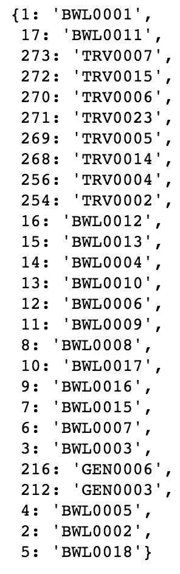
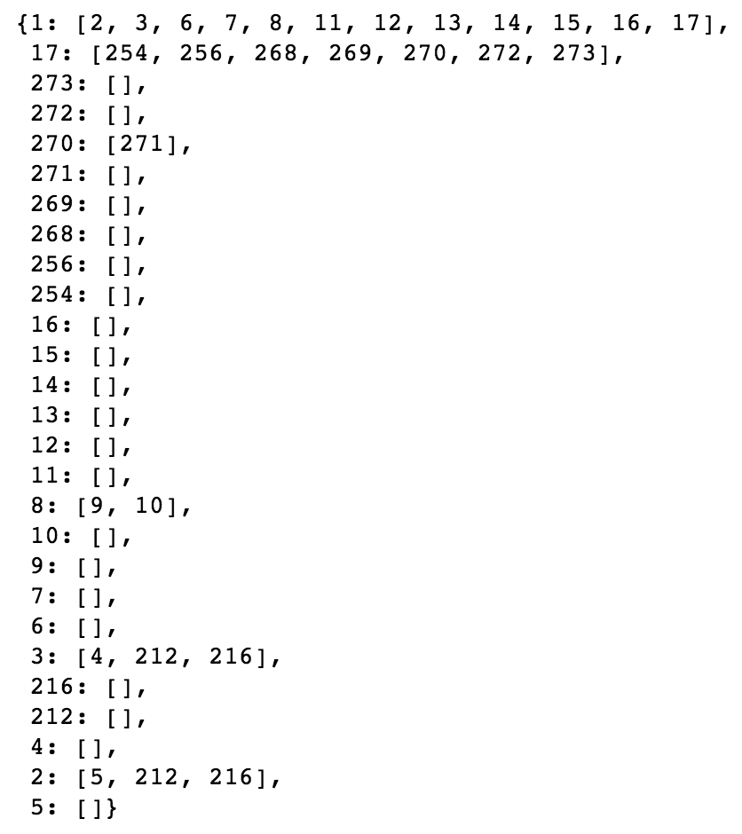

# HPIContent
Function: Load Cydoc knowledge graph and create the entire HPI form with questions and buttons based on the graph and other components listed in the outline.
1. componentDidMount()
    * Load up the [knowledge graph](https://cydocgraph.herokuapp.com/graph)
    * Loop through the knowledge graph nodes to get each unique body system code and category code.
    * For each body system code, save its associated body system name and diseases/categories.
    * Set state with graphData (knowledge graph), category codes and body systems
2. handleItemClick() - responds to the disease tabs shown after page 1 (landing page)
    * The clicked tab’s disease category name will first be translated into its three-letter category code from diseaseCodes.js (in constants).
    * This category code will then be indexed from context and will correspond to its step, which will change the user’s page to that of the current disease.
    * In addition, the active tab will change to be the current disease category, and will be pressed down.
3. render() - each time something changes in the page (i.e. user clicks button), the following items are re-rendered.
    * const diseaseComponents: creates list of body system buttons (<ButtonItem/>)
        * Loops through the state variable body_systems saved after the API was loaded after componentDidMount
        * item[‘name’] - name of the body system
        * item[‘diseases’] - list of categories/diseases associated with the current body system
    * const positiveDiseases: creates list of category buttons that were clicked by user (different color, posted at the top) [<PositiveDiseases/>]
        * First translates chosen category name to its three-letter category prefix.
        * Loops through the HPI context storing which category codes user clicked in the front page 
    * const diseaseTabs: creates the tabs with the user’s clicked or chosen categories, which is displayed on the top of the questionnaire for easy access to different diseases 
        * Loops through the HPI context storing which categories user clicked in the front page 
        * The category will be translated into its three-letter category prefix.
        * this.context[‘activeHPI’] - current category page (that user is on) → if the current category code in the for loop matches the active category, the menu item is marked as active, meaning that it will be displayed as clicked (pressed down) 
        * this.handleItemClick - see handleItemClick
    * switch(step) - depending on the current step, we switch to a different view/page of the form
        * Case 1 is the first page, which is the landing view of HPI with the body systems and disease category buttons
        * Default is any other page of the form, which is personalized with questions and answer inputs based on the current step number (corresponding to specific disease category) - based on <DiseaseForm/>

## ButtonItem 
Function: Creates the buttons of body systems and disease categories found in the first landing page of HPI. Parent of <DiseaseTag/>

### DiseaseTag
Function: Creates the buttons (shaped like tags) for each disease category found in the first landing page of HPI. Called by <ButtonItem/>

## PositiveDiseases
Function: Display just the buttons of positive diseases (same format as those in DiseaseTag) but at the top so that they are easily seen by the user.

## DiseaseForm 
Function: Render the page of the HPI form for each disease.

1. State variables
    * functionLoad: Boolean variable that is true once the knowledge graph is processed and the correct question order and edges are collected in the process_knowledge_graph() function. 
    * question_map: dictionary storing the question components (from <DiseaseFormQuestions/>) as values for each node 
    * response_types: dictionary storing the response types for types "CLICK-BOXES", "MEDS-POP" and "LIST-TEXT". TODO: Remove response_types so that the response_types are variable no matter the type.
2. Context dictionaries
    * The "nodes" dictionary saves each of the nodes (including children) of the current category as keys and saves its knowledge graph entry as its value. 
        * The user response key is later saved as part of the node's value in process_knowledge_graph(), which will save the user's response and prevent the response from being lost if a user clicks in and out of that category's page. 
        * All of the nodes are saved without hierarchy of category (not as values of a category) because there are many cases of children nodes being from a different category. This egalitarian organization allows children of different categories to have a saved response in other category pages. 
    * The "questionOrder_to_node" dictionary saves each node's questionOrder attribute as a key and its node name/medical ID as a value.
    * the "parent_to_child_questionOrder" dictionary saves each node's questionOrder attribute as a key (like the previous dictionary) and the questionOrder of its associated nodes as a value.
        * The advantage of saving questionOrder is that the dictionary can be easily referenced when traversing the knowledge graph multiple times when creating the HPI survey page. All of the nodes MUST be traversed in a first pass in order to know their questionOrders. By saving in a dictionary, we only have O(1) access for future reviews of the knowledge graph's order when creating the array storing the category's question components.
        * An example of both the "questionOrder_to_node" and "parent_to_child_questionOrder" dictionaries are shown at the end of this section.
3. process_knowledge_graph() 
    * Function: iterates through knowledge graph to determine the questionOrder of each child node (and their children) of the original parent node, so that the HPI can be put in order. 
    * Utilizes a queue data structure (and a while loop), since JavaScript does not support recursion but the knowledge graph requires a recursive element to be able to get to up to a 4-node children depth (and potentially more in the future). A stack may have well been used too. 
    * For each iteration of the while loop, the node's questionOrder is saved, and is examined for any child nodes and their questionOrder. These children are then added to the queue to check whether they have child questions too. Thus demonstrates the essential nature of the queue/stack data structures in this situation.
    * questionOrder() is called to organize the questionOrder and nodes names/med IDs of children for a given node into a list to fill the questionOrder_to_node and parent_to_child_questionOrder dictionaries.
        * This function is necessary since children would get lost in the queue and would not be able to be identified with their parent node in the questionOrder_to_node and parent_to_child_questionOrder dictionaries.
    * This function is called in componentDidMount() because it doesn't change after each user's change and shouldn't be re-rendered.
4. questionOrder() 
    * Function: organizes child nodes in order based on their questionOrder attribute. 
    * Parameters: 
        * list_edges: list of edges associated with the parent node, leading to its child nodes. 
        * nodes: all of the nodes from the knowledge graph 
        * edges: all of the edges from the knowledge graph 
        * cat_code: three-letter prefix of the first parent node (0001)/current category 
    * Details: 
        * questionOrder() loops through the parent node's associated edges to lead to its children. 
            * Each of these children are checked for their questionOrder attribute. 
            * Since children from different categories may have the same questionOrder as nodes from the current category (i.e. a parent 0001 node may have a questionOrder of 1.0, like the parent node of the current category), children from different categories receive a weight based on the sum of the unicode values of the three characters in its prefix. 
            * An array containing the questionOrder and child node name/medical ID (respectively) are then pushed to a larger array (called child_ranks) containing the questionOrder, child node name/medical ID for each of the child nodes. 
        * The array child_ranks is then sorted in ascending questionOrder. 
        * After sorting this array, the sorted questionOrder values for each node are put in its own array, and the corresponding ordered child nodes are puts in its own array. 
        * Since JavaScript does not support multiple returns, these two arrays in questionOrder order are pushed to a new array which is returned, to process_knowledge_graph().
5. traversal() 
    * This function is called in render() once the process_knowledge_graph() function is completed, as indicated when the state variable functionLoad is true.
    * Function: iterates through the question components in order of their questionOrder to be displayed on the HPI interview page.
    * A stack is used because there are many children of children of children and a recursive-like function is needed to examine the questions in order. 
        * A stack is used over a queue because child questions, when the parent question's response is "Yes", take priority over other questions on the same level as the parent node. If a queue were used, the children of the first parent node (0001) would be examined in order, and the children of the children would be added to the end of the queue, which would prevent them from being viewed first in this function. Thus, a stack is better used, by pushing the children nodes is descending order to the top of the stack so that they are retrieved in ascending order while also allowing retrieval of children of children in order.
        * During the while loop, a set is used to keep track of which nodes have been examined already. Without this set, the stack would lead to a stack overflow error (endless recursion; in too deep).
    * check_accordion() is called in order to create an expandible accordion for questions of a separate category.
    * In the end, the first parent question is removed because it is assumed that the user is positive for the condition/disease/symptoms if they chose it in the beginning.
6. check_accordion() 
    * Function: checks if all of the children are of a different category than the parent node. If so, they are displayed in an expandible accordion format, since child questions can make the HPI survey pages extremely long to scroll through. However, this function may be depracated soon. 
    

questionOrder_to_node and parent_to_child_questionOrder examples for Bowel Symptoms (BWL), respectively.

 
 

### DiseaseFormQuestions
Function: Identifies the response types to render the interactive elements for the questions of the HPI form using the <QuestionAnswer/> child component. 

#### QuestionAnswer 
Function: Creates custom interactive input feature based on the response type.

Includes: 
* YesNo 
* HandleInput 
* TimeInput 
* ListText 
* ButtonTag 
* HandleNumericInput 
* FamilyHistoryContent 
* MedicalHistoryContent 
* MedicationsContent 
* SurgicalHistoryContent

### accordian 

# Knowledge Graph 
The [knowledge graph](https://cydocgraph.herokuapp.com/graph) is a JSON that guides the HPI form. It is divided into the graph, nodes and edges.

## Graph
* Displays all nodes (as keys) and the values are lists
* Some of the nodes’ values are empty lists, while other nodes (including all those ending in 0001) have items in their list, which are specified edges leading to children questions. 

## Nodes 
* Each node is a unique question 
* Nodes are coded based on their disease category (i.e. BPR = Blood PRessure) and a number that isn’t correlated to the actual order. This is their Med ID 
* Each node also has a unique ID, category, text, response type, question order, and body system

## Edges 
* Each edge is a number in string format, while the values are 
    * “from”: child node 
    * “to”: parent node 

# Definitions 
* Body system: the first buttons you see on the HPI page, i.e. 
* Category: diseases/medical conditions that fit into the body system categories
* Category code: three-letter prefix of each node corresponding to each disease/medical conditions
* Category page: the page in HPI displaying the questions associated with that category. In other words, it is the interview/survey portion for that specific category/disease.
* questionOrder: attribute of each node in the knowledge graph that determines the order of questions on the HPI for a specific graph level
