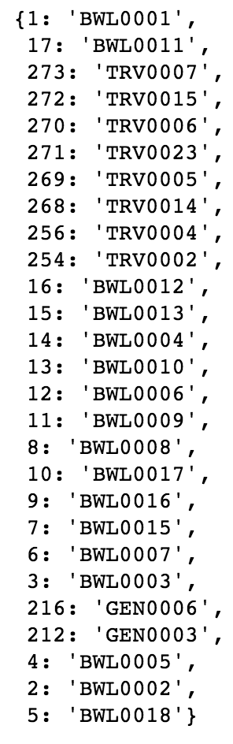
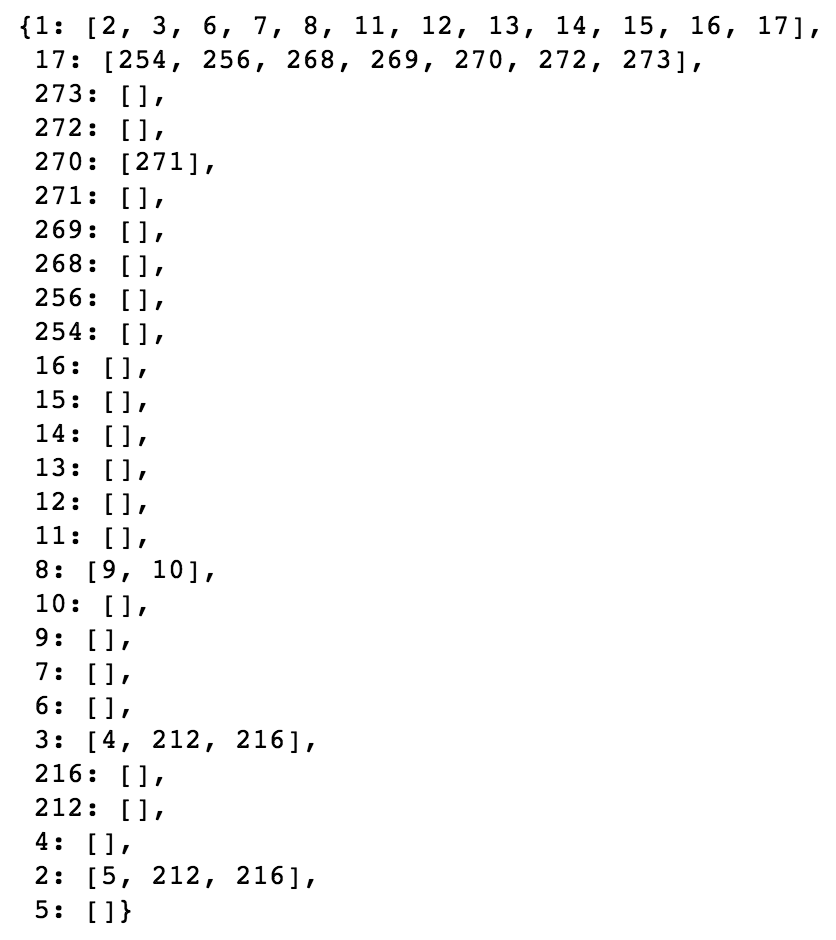

# HPIContent

Function: Load Cydoc body systems and diseases and set up HPI form with questions and buttons based on graph and other components listed in outline.

1. componentDidMount()
    - Load up the [hpi headers graph](https://cydocgraph.herokuapp.com/hpi/CYDOC)
    - set isGraphLoaded to true so render occurs when front page components is ready
    - Save bodySystems and parentNodes dictionaries to state
2. continue(), back()
    - Step will be changed to the index of the selected disease in state to change the user's page to that of the current disease.
    - activeHPI, which represents the active tab, will be changed to the name of the clicked disease, and will be pressed down.
3. render() - each time something changes in the page (i.e. user clicks button), the following items are re-rendered.
    - const diseaseComponents: creates list of body system buttons (<BodySystemDropdown/>).
        - Loops through the state variable body_systems saved after the API was loaded after componentDidMount
        - diseasesList - list of diseases associated with body system
    - const favoritesDiseaseComponent: to be prepended to diseaseComponents (<BodySystemDropdown/>), to show ChiefComplaints
    - const positiveDiseases: creates list of category buttons that were clicked by user (different color, posted at the top) [<PositiveDiseases/>]
        - First translates chosen category name to its three-letter category prefix.
        - Loops through the HPI context storing which category codes user clicked in the front page
    - switch(step) - depending on the current step, we switch to a different view/page of the form
        - Case 1 is the first page, which is the landing view of HPI with the body systems and disease category buttons
        - Default is any other page of the form, which is personalized with questions and answer inputs based on the current step number (corresponding to specific disease category) - based on <DiseaseForm/>

## BodySystemDropdown

Function: Creates the buttons of body systems and corresponding chief complaints found in the first landing page of HPI.

## ChiefComplaintsButtons

Function: Display the buttons of selected chief complaints at the top so that they are easily seen by the user.

## DiseaseForm

Function: Render the page of the HPI form for each disease.

1. State variables
    - isGraphLoaded: Boolean variable true once subgraph is loaded
    - isGraphProcessed: Boolean variable that is true once the knowledge graph is processed and the correct question order and edges are collected in the processKnowledgeGraph() function.
    - parentToChildNodes: dictionary containing mapping between parent node and its child nodes in order
    - graphData
2. processKnowledgeGraph()
    - Function: iterates through knowledge graph to determine the questionOrder of each child node (and their children) of the original parent node, so that the HPI can be put in order.
    - Utilizes a queue data structure (and a while loop), since JavaScript does not support recursion but the knowledge graph requires a recursive element to be able to get to up to a 4-node children depth (and potentially more in the future). A stack may have well been used too.
    - For each iteration of the while loop, the node's questionOrder is saved, and is examined for any child nodes and their questionOrder. These children are then added to the queue to check whether they have child questions too. Thus demonstrates the essential nature of the queue/stack data structures in this situation.
    - questionOrder() is called to organize the questionOrder and nodes names/med IDs of children for a given node into a list to fill the questionOrderToNode and parentToChildQuestionOrder dictionaries.
        - This function is necessary since children would get lost in the queue and would not be able to be identified with their parent node in the questionOrderToNode and parentToChildQuestionOrder dictionaries.
    - This function is called in componentDidMount() because it doesn't change after each user's change and shouldn't be re-rendered.
3. traversal()
    - This function is called in render() once the processKnowledgeGraph() function is completed, as indicated when the state variable functionLoad is true.
    - Function: iterates through the question components in order of their questionOrder to be displayed on the HPI interview page.
    - A stack is used because there are many children of children of children and a recursive-like function is needed to examine the questions in order.
        - A stack is used over a queue because child questions, when the parent question's response is "Yes", take priority over other questions on the same level as the parent node. If a queue were used, the children of the first parent node (0001) would be examined in order, and the children of the children would be added to the end of the queue, which would prevent them from being viewed first in this function. Thus, a stack is better used, by pushing the children nodes is descending order to the top of the stack so that they are retrieved in ascending order while also allowing retrieval of children of children in order.
        - During the while loop, a set is used to keep track of which nodes have been examined already. Without this set, the stack would lead to a stack overflow error (endless recursion; in too deep).
            - Set.has() has sublinear performance but isn't O(1) lookup ([source](https://stackoverflow.com/questions/55057200/is-the-set-has-method-o1-and-array-indexof-on)).
            - In addition, during the while loop, an if statement is called to remove duplicate sets of disease questions that were already called as child questions. For example, if Chest Pain was clicked before Diet, since DIE0001 is a child question within Chest Pain, the Diet tab would dissolve and be unused since they contain the repeat of the questions called from the DIE0001 child question in Chest Pain. The if statement checks if the child node's category is different from the parent node's category, the child node is a parent question of a specific category (ending in 1) and the child node is one of the positive diseases chosen by the user.
    - In the end, the first parent question is removed because it is assumed that the user is positive for the condition/disease/symptoms if they chose it in the beginning.

questionOrderToNode and parentToChildQuestionOrder examples for Bowel Symptoms (BWL), respectively.

### DiseaseFormQuestions

Function: Identifies the response types to render the interactive elements for the questions of the HPI form using the <CreateResponse/> child component.

#### CreateResponse

Function: Creates custom interactive input feature based on the response type.

Includes:

-   YesNo
-   HandleInput
-   TimeInput
-   ListText
-   HandleNumericInput
-   FamilyHistoryContent
-   MedicalHistoryContent
-   MedicationsContent
-   SurgicalHistoryContent
-   BodyLocation
-   LaboratoryTest
-   MultipleChoice
-   ScaleInput

# Knowledge Graph

The [knowledge graph](https://cydocgraph.herokuapp.com/graph) is a JSON that guides the HPI form. It is divided into the graph, nodes and edges.

## Graph

-   Displays all nodes (as keys) and the values are lists
-   Some of the nodes’ values are empty lists, while other nodes (including all those ending in 0001) have items in their list, which are specified edges leading to children questions.

## Nodes

-   Each node is a unique question
-   Nodes are coded based on their disease category (i.e. BPR = Blood PRessure) and a number that isn’t correlated to the actual order. This is their Med ID
-   Each node also has a unique ID, category, text, response type, question order, and body system

## Edges

-   Each edge is a number in string format, while the values are
    -   “from”: child node
    -   “to”: parent node

## Order

# Definitions

-   Body system: the first buttons you see on the HPI page, i.e.
-   Category: diseases/medical conditions that fit into the body system categories
-   Category code: three-letter prefix of each node corresponding to each disease/medical conditions
-   Category page: the page in HPI displaying the questions associated with that category. In other words, it is the interview/survey portion for that specific category/disease.
-   questionOrder: attribute of each node in the knowledge graph that determines the order of questions on the HPI for a specific graph level
